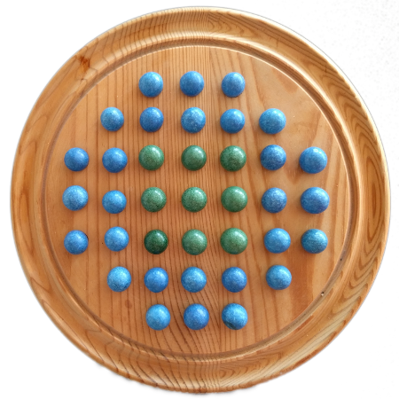

# Marble Solitare
An easy game to play but difficult to win. The game board consist of 37 marbles. And to win the player must remove all but 1 marble.



Wikipedia has a great page about it explaining the rules, [Peg Solitare](https://en.wikipedia.org/wiki/Peg_solitaire).

The code in this repository uses a single threaded brute-force depth-first search. It stops as soon as a solution has been found and prints each board being part of the solution using ASCII characters. The initial marble removed can be tweaked by modifying the ```start``` function in ```board.cpp```.
